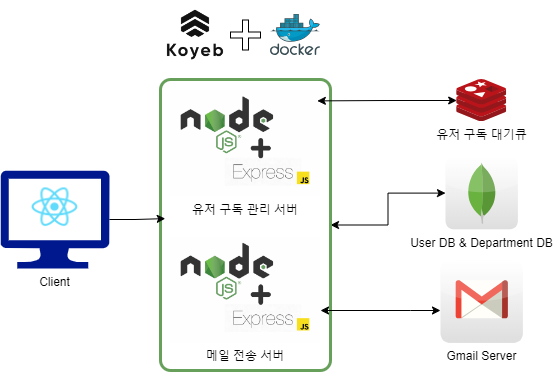
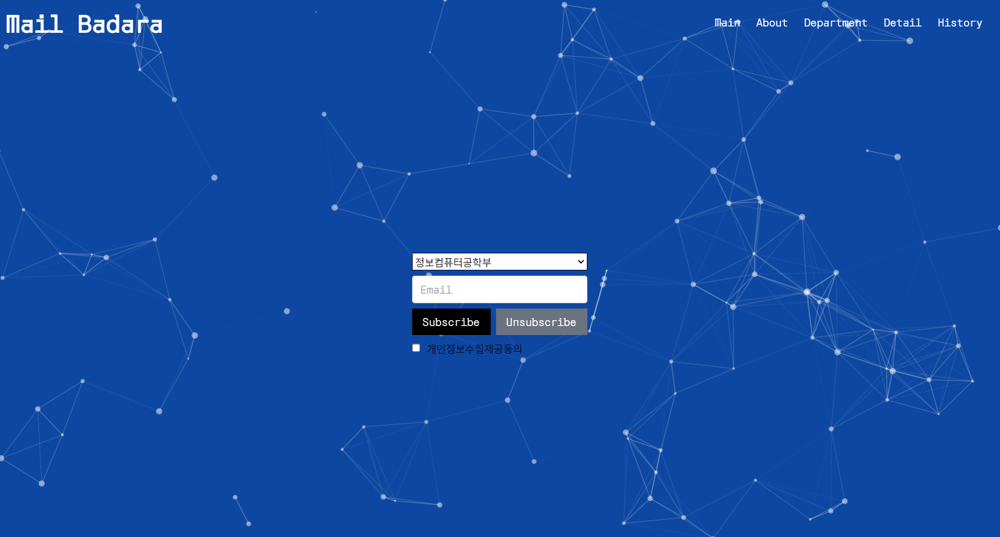
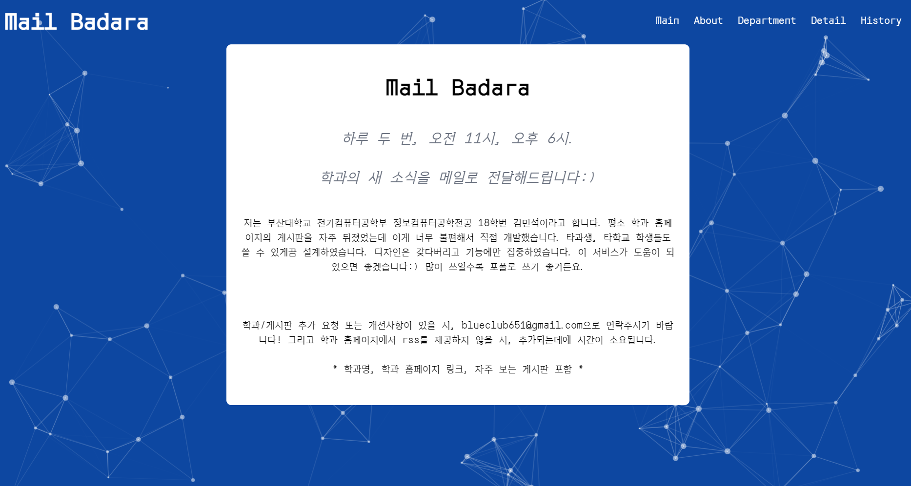
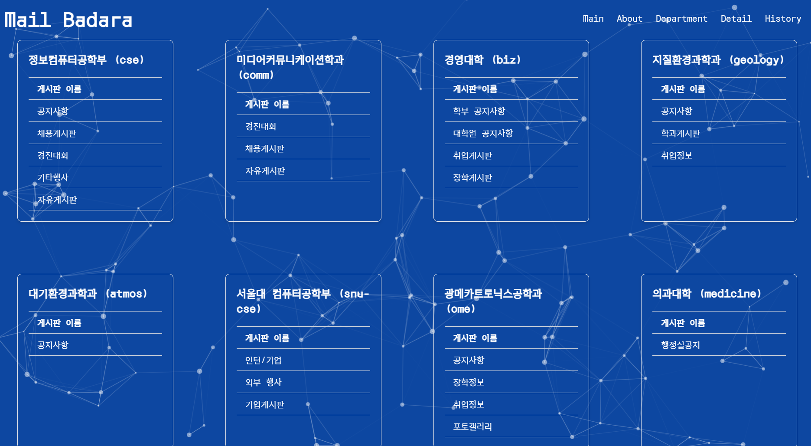
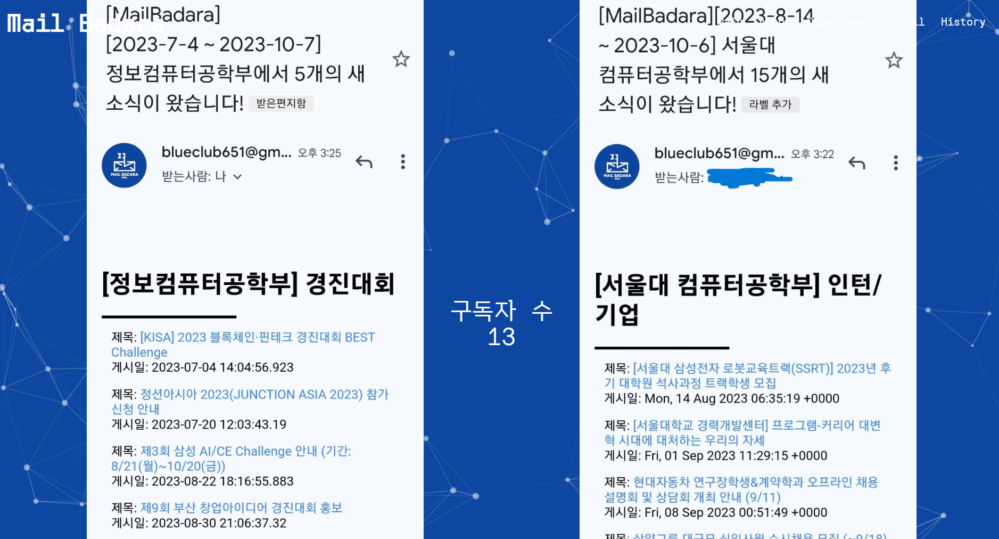
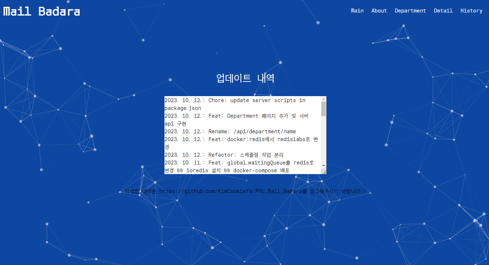

# MailBadara

## 💻 프로젝트 소개

:calendar: 2023.09~current
개인 프로젝트

> 부산대학교 학생들을 위한 학과 홈페이지 뉴스레터 구독 서비스

## 소개 문구

하루 두 번, 오전 11시, 오후 6시.

학과의 새 소식을 메일로 전달해드립니다:)

저는 부산대학교 전기컴퓨터공학부 정보컴퓨터공학전공 18학번
김민석이라고 합니다. 평소 학과 홈페이지의 게시판을 자주 뒤졌었는데
이게 너무 불편해서 직접 개발했습니다. 타과생, 타학교 학생들도 쓸 수
있게끔 설계하였습니다. 디자인은 갖다버리고 기능에만 집중하였습니다. 이
서비스가 도움이 되었으면 좋겠습니다:) 많이 쓰일수록 포폴로 쓰기
좋거든요.

학과/게시판 추가 요청 또는 개선사항이 있을 시, <blueclub651@gmail.com>으로 연락주시기 바랍니다!

## 👋 멤버 구성 및 역할

- @KimCookieYa: 웹 UI 구현 및 메일 검증 로직/메일 전송 로직 구현

## 🔧 아키텍처

## 🌏 개발

### Front-End

- yarn + Vite + React.js + Typescript

### Back-End

- Node.js + Express.js + Typescript + MVC 패턴
- 스케줄링: node-cron
- 메일 전송: nodemailer

### Database

- MongoDB: 학과 및 유저 이메일 관리
- Redis: 검증 리스트 관리

### 배포

- Koyeb 무료 플랜

## 📱 UI

### Main 화면

### About 화면

### Department 화면

### Detail 화면

### History 화면

